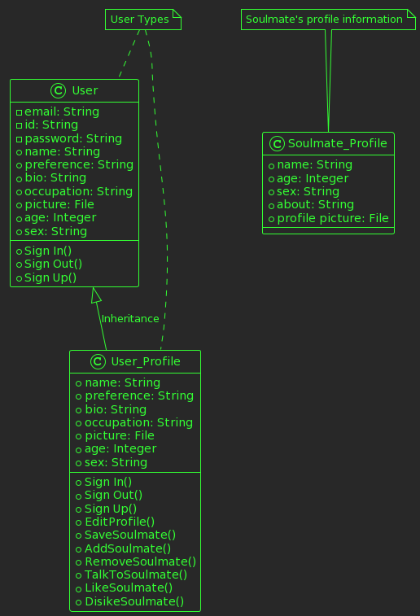

This is the third software project I worked on with my team in our Software Devlopment class. Here is the decription of this software project:

# Description
We created a dating website where a user can make a account and dating profile. They then can start looking for their partner and chat with them so they can get to know them. 

# Design
## Class Diagram
```
@startuml
!theme crt-green
class User{ 
    -email: String
    -id: String
    -password: String
    +name: String
    +preference: String
    +bio: String
    +occupation: String
    +picture: File
    +age: Integer
    +sex: String
    +Sign In()
    +Sign Out()
    +Sign Up()

}

class User_Profile { 
    +name: String
    +preference: String
    +bio: String
    +occupation: String
    +picture: File
    +age: Integer
    +sex: String
    +Sign In()
    +Sign Out()
    +Sign Up()
    +EditProfile()
    +SaveSoulmate()
    +AddSoulmate()
    +RemoveSoulmate()
    +TalkToSoulmate()
    +LikeSoulmate()
    +DisikeSoulmate()
}

User <|-- User_Profile: Inheritance


class Soulmate_Profile{
    +name: String
    +age: Integer
    +sex: String
    +about: String
    +profile picture: File
}

note "Soulmate's profile information" as N1
note "User Types" as N2
N1 .. Soulmate_Profile
N2 .. User
N2 .. User_Profile
@endum
@enduml
```

## sequence diagram
```
@startuml Website scenario 1
skin rose

participant User
entity "Web Server"
database Database

User --> "Web Server": Creates user account
"Web Server" -> Database: update "another user account has been made"
Database -> "Web Server": response: user account successfully saved
"Web Server" --> User: redirects sign page to create profile page

User --> "Web Server": Creates user profile 
"Web Server" -> Database: update "another user profile has been made"
Database -> "Web Server": response: user account successfully saved
"Web Server" --> User: redirects create profile page to login page

User --> "Web Server": Sends login information 
"Web Server" -> Database: query "Is the user's id and password authenticated?"
Database -> "Web Server": response: true or false 


alt "Successful authentication"

  "Web Server" --> User: redirects login page to user's homepage
  User --> "Web Server": clicks the 'search for your partner' button
  "Web Server" -> Database: request: "is the user authorized to visit this site?"
  Database -> "Web Server" : response: yes
 "Web Server" --> User: redirects user's homepage to soulmates page

  User --> "Web Server": clicks the 'edit profile' button
  "Web Server" -> Database: request: "is the user authorized to visit this site?"
  Database -> "Web Server" : response: yes
 "Web Server" --> User: redirects user's homepage to edit profile page

User --> "Web Server": clicks the 'edit profile' button
  "Web Server" -> Database: request: "can the user sign out"
  Database -> "Web Server" : response: yes
 "Web Server" --> User: redirects user's homepage to login page

else "Failed authentication"
    "Web Server" --> User: authentication failure message
end
@enduml
```

## use case diagram
```
@startuml

:User:
:For Real Celebrity 100%:

left to right direction

package system {
(Login Database)
(Profile Database)
(Chat Database)
package website {
(Sign-In)
(Sign-Up)
(Create Profile)
(View Profiles)
(View Matches)
(Chat With Matches)
}
}

:User: --> (Sign-Up) :create account
:User: --> (Sign-In) :login
:User: --> (Create Profile) :edit profile
:User: --> (View Profiles) :swipey
(Sign-Up) --> (Create Profile) :add details
(Sign-Up) --> (Login Database) :add account
(Sign-In) --> (Login Database) :access account
(Create Profile) --> (Profile Database) :add profile
(View Profiles) --> (Profile Database) :iterate through profiles
(View Profiles) --> (View Matches)
(View Matches) --> (Chat With Matches)
(Chat With Matches) --> (Chat Database) :access chat history
:For Real Celebrity 100%: --> (Chat With Matches) :chat gpt
@enduml
```


# User Stories

# US#1
As an unregistered user, I aim to sign up to create my account and share information about myself, with the goal of finding a perfect match. Once I complete all the necessary fields and information required for my profile, my account will be saved. This will enable me to log in using the 'Sign In' button whenever I want to access my account.

# US#2
As a user logging into my account, Once authenticated, I land on the homepage featuring profiles presented for potential matches with a checkmark and an X. There should be navigational buttons for editing profile, and viewing chats.

# US#3
As a user, I want to easily modify and update my profile information. Upon accessing the homepage, I click the 'Edit Profile' button, enabling me to adjust details like bio, photos, preferences, or any relevant information. After making changes, I confirm the updates and they are saved.

# US#4
As a user seeking potential matches viewing available profiles, I encounter profiles aligning with my gender preference. There are buttons with a checkmark and an X. If I like someone, I click the checkmark, and if I don't, I click the X. This helps me pick the people I want to match with or not match with.

# US#5
As a user who has found matches on the homepage, I check the 'Matches' section to see people who also liked me. Once there, I choose someone from the list by clicking on their profile. This action opens a chat window, allowing me to start a conversation with that person. This way, I can easily connect with someone I matched with and start getting to know them better through chatting.

# US#6
As a tester responsible for the user authentication module of our web application, I want to ensure its robustness, security, and seamless functionality to provide a positive user experience. This involves both white-box and black-box testing methodologies.

# US#7 (optional)
As a user, I want to engage in conversations with 100% real (totally real) celebrity profiles, which are certainly NOT AI chatbots like ChatGPT. When I visit the platform's chat section, I select a profile and a TOTALLY REAL celebrity responds to my messages instantly (because I’m that important).

# Development Process
This section should be used to describe how the scrum methodology was used in this project. As a suggestion, include the following table to summarize how the sprints occurred during the development of this project.

|Sprint#|Goals|Start|End|Done|Observations|
|---|---|---|---|---|---|
|1|US#1, US#2|11/09/23|11/16/23|US#1 and US#2|Time was our biggest concern during this sprint|
|2|US#3, US#4|11/16/23|11/30/23|US#3 and US#4|Time was less of a concern but now its Error that became the new concern|
|3|US#5, US#6|11/30/23|12/7/23|US#5 and US#6|Error and testing was a concern|

# Testing 
| Name                  | Stmts | Miss | Cover |
|-----------------------|-------|------|-------|
| app/__init__.py       | 31    | 4    | 87%   |
| app/forms.py          | 27    | 0    | 100%  |
| app/models.py         | 35    | 0    | 100%  |
| app/routes.py         | 182   | 130  | 29%   |
| tests/test_black.py   | 13    | 0    | 100%  |
| tests/test_white.py   | 19    | 0    | 100%  |
| **TOTAL**             | **307**| **134**| **56%**|

White Test:
A unittest test case that verifies the profile creation functionality in the application. This test simulates the process of creating a user profile in the application, ensuring that the profile is successfully created and stored in the database. The test operates in a controlled environment using an in-memory SQLite database, which allows for testing without affecting the actual database.

Black Test:
this test case checks whether the profile update endpoint in a Flask application works as expected when a user attempts to update their profile, particularly focusing on whether it returns a successful response when provided with valid input.
