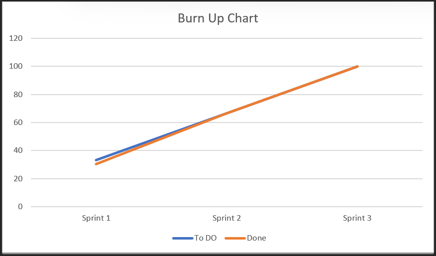
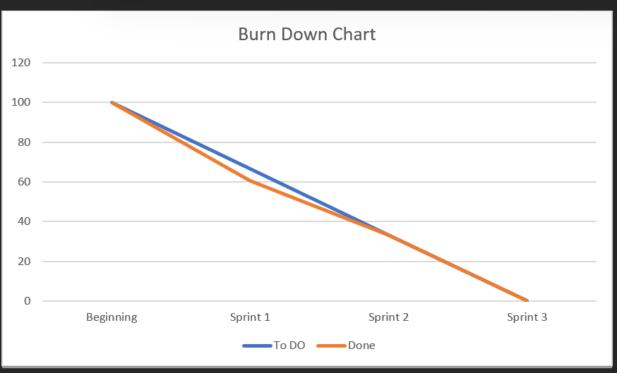

# Sprint Planning #1
Date/Time: 11/09/23
Participants: Jaylon, Aaron, Ricardo, Seth, Ben
Goal Statement: To Get US1 and US2 working

# Daily Scrums
## 11/10/23-2:30pm
Participants: Jaylon, Aaron, Ricardo, Seth, Ben
Name: Jaylon
What did you do yesterday?: Working on the Jira to be set up.
What are you doing today?: Create user class w/ profile info
Are there any obstacles in your path?: Finding the time to do it.

Name: Ben
What did you do yesterday?: Worked on our Use case Diagram
What are you doing today?: sign in / sign up buttons and having it go to the page.
Are there any obstacles in your path?: Time management

Name: Seth
What did you do yesterday?: Working on Sequence Diagram
What are you doing today?: profile form (name, preference, bio, occupation, picture)
Are there any obstacles in your path?: Time

Name: Ricardo
What did you do yesterday?: Getting the scrum templates and the ReadMe md file getting ready to have our mission statement and others.
What are you doing today?: place website name at top of sign-in page
Are there any obstacles in your path?: Time management

Name: Aaron
What did you do yesterday?: Working on Class Diagram
What are you doing today?: set up login database
Are there any obstacles in your path?: Time management

## 11/12/23-5:30pm
Participants: Jaylon, Aaron, Ricardo, Seth, Ben
Name: Jaylon
What did you do yesterday?: Create user class w/ profile info
What are you doing today?: Create user class w/ profile info
Are there any obstacles in your path?: Time management

Name: Ben
What did you do yesterday?: Sign in / sign up buttons and having it go to the page.
What are you doing today?: Sign in / sign up buttons and having it go to the page.
Are there any obstacles in your path?: Time management

Name: Seth
What did you do yesterday?: profile form (name, preference, bio, occupation, picture)
What are you doing today?: profile form (name, preference, bio, occupation, picture)
Are there any obstacles in your path?: Time management

Name: Ricardo
What did you do yesterday?: place website name at top of sign-in page
What are you doing today?: place website name at top of sign-in page
Are there any obstacles in your path?: Time management

Name: Aaron
What did you do yesterday?: set up login database
What are you doing today?: set up login database
Are there any obstacles in your path?: Code might not work time running out.

## 11/15/23-6:30pm
Participants: Jaylon, Aaron, Ricardo, Seth, Ben
Name: Jaylon
What did you do yesterday?: Create user class w/ profile info
What are you doing today?: login authentication w/ error handling
Are there any obstacles in your path?: Time

Name: Ben
What did you do yesterday?: Sign in / sign up buttons and having it go to the page.
What are you doing today?: view matches button
Are there any obstacles in your path?: Time

Name: Seth
What did you do yesterday?: profile form (name, preference, bio, occupation, picture)
What are you doing today?: sign out button, and edit profile button
Are there any obstacles in your path?: TIme

Name: Ricardo
What did you do yesterday?: place website name at top of sign-in page
What are you doing today?: design html for homepage sign out button
Are there any obstacles in your path?: Time

Name: Aaron
What did you do yesterday?: set up login database
What are you doing today?: create X and checkmark button
Are there any obstacles in your path?: Time
# Sprint Review
Date/Time: 11/16/23 2:00pm
Participants: Aaron, Ricardo, Seth, Ben
Notes: We did great we got US1 and US2 working just like we planned.

# Sprint Retrospective
Date/Time: 11/17/23 2:30pm
Participants: Jaylon, Aaron, Ricardo, Seth, Ben
Notes: We will start working on time management knowing we are working on our finals for other classes but we need to work better for our next sprints.

# Sprint Planning #2
Date/Time: 11/16/23 2:00pm
Participants: Jaylon, Aaron, Ricardo, Seth, Ben
Goal Statement: To Get US3 and US4 working

# Daily Scrums
# 11/20/23-7:30pm
Participants: Jaylon, Aaron, Ricardo, Seth, Ben
Name: Jaylon 
What did you do yesterday?: login authentication w/ error handling
What are you doing today?: create new html
Are there any obstacles in your path?: Time, and errors

Name: Ben
What did you do yesterday?: view matches button
What are you doing today?: create form
Are there any obstacles in your path?: Time being on break

Name: Seth
What did you do yesterday?: sign out button, and edit profile button
What are you doing today?: have form update user object in db
Are there any obstacles in your path?: Time being on break

Name: Ricardo
What did you do yesterday?: design html for homepage sign out button
What are you doing today?: put navigation buttons to return back to homepage
Are there any obstacles in your path?: Time being on break

Name: Aaron
What did you do yesterday?: create X and checkmark button
What are you doing today?: add age limit
Are there any obstacles in your path?: Time being on break

# 11/26/23-12:00pm
Participants: Jaylon, Aaron, Ricardo, Seth, Ben
Name: Jaylon
What did you do yesterday?: create new html
What are you doing today?: create new html
Are there any obstacles in your path?: No challenges so far.

Name: Ben
What did you do yesterday?: create form
What are you doing today?: create form
Are there any obstacles in your path?: Almost done no obstacles

Name: Seth
What did you do yesterday?: have form update user object in db
What are you doing today?: have form update user object in db
Are there any obstacles in your path?: Errors making me loose time.

Name: Ricardo
What did you do yesterday?: put navigation buttons to return back to homepage
What are you doing today?: put navigation buttons to return back to homepage
Are there any obstacles in your path?: No obstacles almost done.

Name: Aaron
What did you do yesterday?: add age limit
What are you doing today?: add age limit
Are there any obstacles in your path?: No obstacles almost done and will have it ready on time.

## 11/27/23-12:30pm
Participants: Jaylon, Aaron, Ricardo, Seth, Ben
Name: Jaylon
What did you do yesterday?: create new html
What are you doing today?: if 50% passes add match to match list on user
Are there any obstacles in your path?: Error hanlding

Name: Ben
What did you do yesterday?: create form
What are you doing today?: "chat now" button on match
Are there any obstacles in your path?: Error hanlding

Name: Seth
What did you do yesterday?: have form update user object in db
What are you doing today?: two lists under user model, "matches" and "clashes"
Are there any obstacles in your path?: Error hanlding

Name: Ricardo
What did you do yesterday?: put navigation buttons to return back to homepage
What are you doing today?: do not show any profiles on home page that belong to match or clash list
Are there any obstacles in your path?: Time management

Name: Aaron
What did you do yesterday?: add age limit
What are you doing today?: if 50% fails or X is pressed add person to clash list on user
Are there any obstacles in your path?: Time management
# Sprint Review
Date/Time: 11/30/23 2:00pm
Participants: Aaron, Ricardo, Seth, Ben
Notes: We did great we got US3 and US4 working just like we planned. Love how we had break to also work on this sprint.

# Sprint Retrospective
Date/Time: 11/30/23 2:30pm
Participants: Jaylon, Aaron, Ricardo, Seth, Ben
Notes: Now Error handling is a probelm but we so far are doing great on time, We are going to work on US5 and 6.

# Sprint Planning #3
Date/Time: 11/30/23 2:00pm
Participants: Jaylon, Aaron, Ricardo, Seth, Ben
Goal Statement: To Get US5 and US6 working

# Daily Scrums
# 12/03/23-12:30pm
Participants: Jaylon, Aaron, Ricardo, Seth, Ben
Name: Jaylon 
What did you do yesterday?: if 50% passes add match to match list on user
What are you doing today?: find chat box api with flask that makes this way easier
Are there any obstacles in your path?: Time management

Name: Ben
What did you do yesterday?: "chat now" button on match
What are you doing today?: iterate through the "matches" list on user model to show all matches
Are there any obstacles in your path?: Time management

Name: Seth
What did you do yesterday?: two lists under user model, "matches" and "clashes"
What are you doing today?: iterate through the "matches" list on user model to show all matches
Are there any obstacles in your path?: Errors keeping me from being done

Name: Ricardo
What did you do yesterday?: do not show any profiles on home page that belong to match or clash list
What are you doing today?: unmatch button closes chat and unmatches
Are there any obstacles in your path?: Errors keeping me from finshing on time

Name: Aaron
What did you do yesterday?: if 50% fails or X is pressed add person to clash list on user
What are you doing today?: create chat box
Are there any obstacles in your path?: Time

# 12/05/23-12:00pm
Participants: Jaylon, Aaron, Ricardo, Seth, Ben
Name: Jaylon
What did you do yesterday?: find chat box api with flask that makes this way easier
What are you doing today?: Start working on unit testing
Are there any obstacles in your path?: Errors

Name: Ben
What did you do yesterday?: iterate through the "matches" list on user model to show all matches
What are you doing today?: Start working on unit testing
Are there any obstacles in your path?: 

Name: Seth
What did you do yesterday?: iterate through the "matches" list on user model to show all matches
What are you doing today?: Start working on unit testing
Are there any obstacles in your path?: Time management

Name: Ricardo
What did you do yesterday?: unmatch button closes chat and unmatches
What are you doing today?: Start working on unit testing
Are there any obstacles in your path?: Errors

Name: Aaron
What did you do yesterday?: create chat box
What are you doing today?: Start working on unit testing
Are there any obstacles in your path?: Errors

## 12/06/23-2:00pm
Participants: Jaylon, Aaron, Ricardo, Seth, Ben
Name: Jaylon
What did you do yesterday?: Start working on unit testing
What are you doing today?: Finishing up any left over errors
Are there any obstacles in your path?: Just the Errors

Name: Ben
What did you do yesterday?: Start working on unit testing
What are you doing today?: Checking Errors
Are there any obstacles in your path?: Just Errors

Name: Seth
What did you do yesterday?: Start working on unit testing
What are you doing today?: Unit test report
Are there any obstacles in your path?: 

Name: Ricardo
What did you do yesterday?: Start working on unit testing
What are you doing today?: Look over if we meet all the requirments in the rubric
Are there any obstacles in your path?: Nothing so far

Name: Aaron
What did you do yesterday?: Start working on unit testing
What are you doing today?: Checking Errors
Are there any obstacles in your path?: Just Errors and time management
# Sprint Review
Date/Time: 12/07/23 2:00pm
Participants: Aaron, Ricardo, Seth, Ben
Notes: We did great, we got US5 and US6 working just like we planned. We have finished our project and this sprint went really well.

# Sprint Retrospective
Date/Time: 12/07/23 2:30pm
Participants: Jaylon, Aaron, Ricardo, Seth, Ben
Notes: We had fun making this project and we hope the professor really like what we have done.

# Burn Up Chart

# Burn Down Chart
